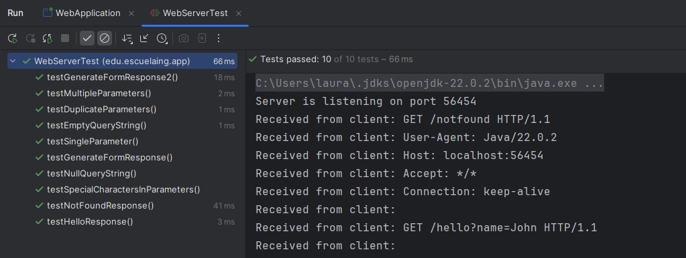
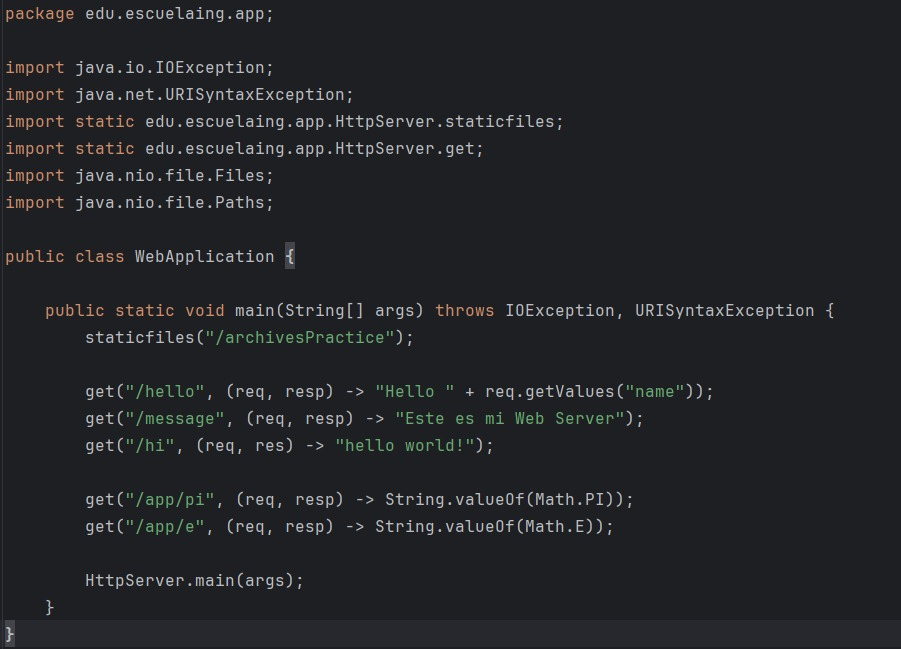

# Lab2 AREP

Este proyecto tiene como objetivo mejorar un servidor web existente, que actualmente admite archivos HTML, JavaScript, CSS e imágenes, al convertirlo en un marco web completamente funcional. Este marco permitirá el desarrollo de aplicaciones web con servicios REST de backend. El nuevo marco proporcionará a los desarrolladores herramientas para definir servicios REST mediante funciones lambda, administrar valores de consulta dentro de solicitudes y especificar la ubicación de archivos estáticos.
## Comenzando

Se debe clonar el proyecto localmente con el comando:

` git clone https://github.com/lalaro/Lab1AREP.git`

Y luego revisar las intrucciones a continuación para el manejo de soluciones del proyecto.

El desarrollo del Laboratorio es el siguiente:

Como arquitectura tenemos:

Explicación de arquitectura: 

Este diagrama representa una arquitectura de sistema distribuido que involucra un cliente web, un servidor HTTP y un servidor backend, todos comunicándose a través de una red local. El cliente web realiza solicitudes al servidor HTTP, quien a su vez puede solicitar datos JSON al servidor backend. Además, el servidor HTTP sirve archivos estáticos (HTML, CSS, JS, PNG, JPEG) directamente al cliente.
En el diagrama se establece el puerto 35000 utilizado para la comunicación y la especificación de la ruta GET. El Local Server indica que todos los componentes residen en el mismo entorno local.

Desarrollo del lab:

1. GET Static Method for REST Services:
   Implement a get() method that allows developers to define REST services using lambda functions.
   Example Usage:
   get("/hello", (req, res) -> "hello world!");
   This feature will enable developers to define simple and clear routes within their applications, mapping URLs to specific lambda expressions that handle the requests and responses.

Así se visualizara: 

2. Query Value Extraction Mechanism:
   Develop a mechanism to extract query parameters from incoming requests and make them accessible within the REST services.
   Example Usage:
   get("/hello", (req, res) -> "hello " + req.getValues("name"));
   This functionality will facilitate the creation of dynamic and parameterized REST services, allowing developers to easily access and utilize query parameters within their service implementations.

Así se visualizara:

3. Static File Location Specification:
   Introduce a staticfiles() method that allows developers to define the folder where static files are located.
   Example Usage:
   staticfiles("webroot/public");
   The framework will then look for static files in the specified directory, such as target/classes/webroot/public, making it easier for developers to organize and manage their application's static resources.

4. Additional Tasks:
   Build an example demonstrating how applications would be developed on your server.

Finalmente así se veran las busquedas:

Para http://localhost:35000/index.html

Para http://localhost:35000/index.html, dando le click al botón "Haz click para saber más"

Para http://localhost:35000/archive1.html

Para http://localhost:35000/hi

Para http://localhost:35000/app/pi

Para http://localhost:35000/app/e

http://localhost:35000/hello?name=Doraemon o cualquier otro nombre que se desee agregar

### Prerrequisitos

Se necesita de Maven (La versión más reciente) y Java 21, la instalación debe realizarse desde las paginas oficiales de cada programa.

### Instalación

Para Maven debe irse a https://maven.apache.org/download.cgi, descargar la versión más nueva que allá de Maven (En este caso tenemos la versión 3.9.6) y agregarse en la carpeta de Program Files, luego se hace la respectiva configuración de variables de entorno según la ubicación que tenemos para el archivo de instalación, tanto de MAVEN_HOME y de Path.
Luego revisamos que haya quedado bien configurado con el comando para Windows:

` mvn - v `
o
` mvn -version `

Para Java debe irse a https://www.oracle.com/java/technologies/downloads/?er=221886, descargar la versión 21 de Java y agregarse en la carpeta de Program Files, luego se hace la respectiva configuración de variables de entorno según la ubicación que tenemos para el archivo de instalación, tanto de JAVA_HOME y de Path.
Luego revisamos que haya quedado bien configurado con el comando para Windows:

` java -version `

## Ejecutando las pruebas

Podemos Abrir en terminal el proyecto y ejecutar las pruebas desde el PowerShell, en el caso de Windows. Y ejecutamos el comando:

` mvn test `

O de igual forma en el ID que deseemos.

Así se vera:

### Desglose en pruebas de extremo a extremo

1. testHelloResponse
   Qué prueba: Este test verifica que la ruta /hello con un parámetro de consulta name=John retorne la respuesta correcta con el estado 200 OK.
   Por qué la prueba: Es una prueba fundamental para asegurar que la ruta /hello del servidor responde correctamente a las solicitudes con parámetros, devolviendo una respuesta esperada que contenga un mensaje personalizado. Si falla, indica que el servidor no está manejando adecuadamente los parámetros en las solicitudes GET.

2. testNotFoundResponse
   Qué prueba: Este test verifica que el servidor retorne un código de estado 404 cuando se hace una solicitud a una ruta inexistente, como /notfound.
   Por qué la prueba: Es importante comprobar que el servidor responde adecuadamente a las solicitudes a rutas que no existen. Un fallo aquí podría significar que el servidor no maneja correctamente los errores de rutas no encontradas.

3. testEmptyQueryString
   Qué prueba: Este test verifica que cuando se recibe una cadena de consulta vacía, el servidor no encuentre valores para los parámetros y devuelva null para todos los parámetros solicitados. 
   Por qué la prueba: Asegura que el servidor maneje correctamente las solicitudes sin parámetros en la cadena de consulta. Si no se manejan correctamente, podría causar errores o resultados inesperados.

4. testDuplicateParameters
   Qué prueba: Este test verifica que si un parámetro de consulta aparece varias veces, como name=John&name=Alice, el servidor debe devolver el último valor de ese parámetro (Alice).
   Por qué la prueba: Es fundamental para garantizar que el servidor maneje adecuadamente los parámetros duplicados. Si el servidor no lo hace bien, podría generar resultados incorrectos.

5. testGenerateFormResponse
   Qué prueba: Este test verifica que la respuesta generada por DefaultResponse.generateFormResponse() comience con el estado 200 OK y contenga un formulario HTML con las rutas correctas (/hello y /hellopost), además de las funciones JavaScript necesarias.
   Por qué la prueba: Es una prueba importante para asegurar que el servidor devuelva la respuesta correcta con un formulario HTML y el JavaScript necesario para la interacción con el servidor. Un fallo aquí indicaría un problema con la generación de la respuesta HTML.

6. testSingleParameter
   Qué prueba: Este test verifica que, cuando se recibe un solo parámetro de consulta, como name=John, el servidor devuelva el valor correcto de ese parámetro.
   Por qué la prueba: Es una prueba básica para asegurar que el servidor maneja correctamente los parámetros simples en la cadena de consulta. Si falla, podría indicar un problema con el manejo de parámetros.

7. testSpecialCharactersInParameters
   Qué prueba: Este test verifica que los parámetros de consulta que contienen caracteres especiales, como espacios o caracteres codificados (por ejemplo, %20), sean procesados correctamente.
   Por qué la prueba: Es crucial asegurarse de que el servidor pueda manejar caracteres especiales en los parámetros de consulta. Un error en esta prueba podría llevar a que los parámetros no sean interpretados correctamente, afectando la funcionalidad.

8. testMultipleParameters
   Qué prueba: Este test verifica que el servidor pueda manejar correctamente múltiples parámetros en la cadena de consulta y devolver los valores esperados.
   Por qué la prueba: Verifica que el servidor maneje correctamente solicitudes con múltiples parámetros, lo cual es común en muchas aplicaciones. Si falla, podría indicar que el servidor no procesa correctamente las consultas complejas.

9. testNullQueryString
   Qué prueba: Este test verifica que, cuando se recibe una cadena de consulta nula (null), el servidor no genere errores y devuelva null para los parámetros solicitados.
   Por qué la prueba: Esta prueba asegura que el servidor maneje adecuadamente las solicitudes con cadenas de consulta nulas. Si no se maneja correctamente, podría generar excepciones o comportamientos inesperados.

10. testGenerateFormResponse2
    Qué prueba: Este test verifica que la respuesta generada por DefaultResponse.generateFormResponse() contiene la estructura HTML básica, los formularios adecuados y las funciones JavaScript necesarias, similar a la prueba testGenerateFormResponse.
    Por qué la prueba: Asegura que el servidor genera correctamente el contenido HTML y JavaScript para interactuar con el cliente. Un fallo podría indicar problemas en la generación de respuestas HTML, lo que afectaría la interacción con el cliente.

### Y pruebas de estilo de código

Las pruebas en el conjunto de tests se diseñaron para asegurar que el servidor web se comporte correctamente en diversas situaciones comunes y posibles escenarios de uso. Se verifica que las rutas respondan correctamente, manejando tanto solicitudes válidas como inválidas. Las pruebas también garantizan que el servidor procese adecuadamente los parámetros de consulta, incluyendo casos como parámetros duplicados, especiales o vacíos. Además, se valida la correcta generación de respuestas HTML con formularios interactivos y funciones JavaScript necesarias para la comunicación con el servidor. Estas pruebas son esenciales para confirmar que el servidor pueda manejar adecuadamente tanto las solicitudes simples como las más complejas, asegurando su estabilidad, fiabilidad y capacidad para ofrecer una experiencia coherente al usuario.

## Despliegue

Podemos Abrir en terminal el proyecto y compilar y empaquetar el proyecto desde el PowerShell, en el caso de Windows. Y ejecutamos los comandos:

` mvn clean `

` mvn compile `

` mvn package `

O de igual forma en el ID que deseemos.

Así se vera:

Es importante aclarar que para obtener todas las peticiones presentadas en los ejemplos anteriores, se debe compilar la clase **WebApplication.java**, ya que es la clase principal.

## Construido con

* [Maven](https://maven.apache.org/) - Gestión de dependencias.
* [Java](https://www.java.com/es/) - Versionamiento en Java.

## Contribuyendo

Por favor, lee [CONTRIBUTING.md](https://gist.github.com/PurpleBooth/b24679402957c63ec426) para detalles sobre nuestro código de conducta y el proceso para enviarnos solicitudes de cambios (*pull requests*).

## Versionado

Usamos [SemVer](http://semver.org/) para el versionado.

## Autores

* **Laura Valentina Rodríguez Ortegón** - *Lab2 AREP* - [Repositorio](https://github.com/lalaro/Laboratorio-2AREP.git)

## Licencia

Este proyecto está licenciado bajo la Licencia MIT - consulta el archivo [LICENSE.md](LICENSE.md) para más detalles.

## Reconocimientos

* Agradecimientos a la Escuela Colombiana de Ingeniería
* La documentación de Git Hub
* Al profesor Luis Daniel Benavides
