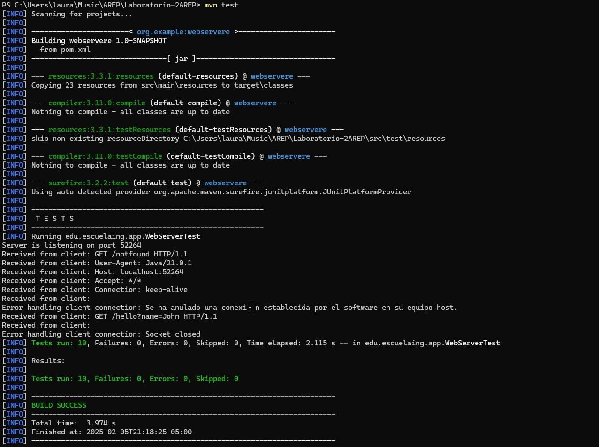

# Lab2 AREP

Este proyecto tiene como objetivo mejorar un servidor web existente, que actualmente admite archivos HTML, JavaScript, CSS e imágenes, al convertirlo en un marco web completamente funcional. Este marco permitirá el desarrollo de aplicaciones web con servicios REST de backend. El nuevo marco proporcionará a los desarrolladores herramientas para definir servicios REST mediante funciones lambda, administrar valores de consulta dentro de solicitudes y especificar la ubicación de archivos estáticos.
## Comenzando

Se debe clonar el proyecto localmente con el comando:

` git clone https://github.com/lalaro/Lab1AREP.git`

Y luego revisar las intrucciones a continuación para el manejo de soluciones del proyecto.

El desarrollo del Laboratorio es el siguiente:

Como arquitectura tenemos:

1. GET Static Method for REST Services:
   Implement a get() method that allows developers to define REST services using lambda functions.
   Example Usage:
   get("/hello", (req, res) -> "hello world!");
   This feature will enable developers to define simple and clear routes within their applications, mapping URLs to specific lambda expressions that handle the requests and responses.

Así se visualizara: 

2. Query Value Extraction Mechanism:
   Develop a mechanism to extract query parameters from incoming requests and make them accessible within the REST services.
   Example Usage:
   get("/hello", (req, res) -> "hello " + req.getValues("name"));
   This functionality will facilitate the creation of dynamic and parameterized REST services, allowing developers to easily access and utilize query parameters within their service implementations.

Así se visualizara:

3. Static File Location Specification:
   Introduce a staticfiles() method that allows developers to define the folder where static files are located.
   Example Usage:
   staticfiles("webroot/public");
   The framework will then look for static files in the specified directory, such as target/classes/webroot/public, making it easier for developers to organize and manage their application's static resources.

4. Additional Tasks:
   Build an example demonstrating how applications would be developed on your server.

Finalmente así se veran las busquedas:

Para http://localhost:35000/index.html

Para http://localhost:35000/index.html, dando le click al botón "Haz click para saber más"

Para http://localhost:35000/archive1.html

Para http://localhost:35000/hi

Para http://localhost:35000/app/pi

Para http://localhost:35000/app/e

http://localhost:35000/hello?name=Doraemon o cualquier otro nombre que se desee agregar

### Prerrequisitos

Se necesita de Maven (La versión más reciente) y Java 21, la instalación debe realizarse desde las paginas oficiales de cada programa.

### Instalación

Para Maven debe irse a https://maven.apache.org/download.cgi, descargar la versión más nueva que allá de Maven (En este caso tenemos la versión 3.9.6) y agregarse en la carpeta de Program Files, luego se hace la respectiva configuración de variables de entorno según la ubicación que tenemos para el archivo de instalación, tanto de MAVEN_HOME y de Path.
Luego revisamos que haya quedado bien configurado con el comando para Windows:

` mvn - v `
o
` mvn -version `

Para Java debe irse a https://www.oracle.com/java/technologies/downloads/?er=221886, descargar la versión 21 de Java y agregarse en la carpeta de Program Files, luego se hace la respectiva configuración de variables de entorno según la ubicación que tenemos para el archivo de instalación, tanto de JAVA_HOME y de Path.
Luego revisamos que haya quedado bien configurado con el comando para Windows:

` java -version `

## Ejecutando las pruebas

Podemos Abrir en terminal el proyecto y ejecutar las pruebas desde el PowerShell, en el caso de Windows. Y ejecutamos el comando:

` mvn test `

O de igual forma en el ID que deseemos.

Así se vera:

### Desglose en pruebas de extremo a extremo

### Y pruebas de estilo de código

## Despliegue

Podemos Abrir en terminal el proyecto y compilar y empaquetar el proyecto desde el PowerShell, en el caso de Windows. Y ejecutamos los comandos:

` mvn clean `

` mvn compile `

` mvn package `

O de igual forma en el ID que deseemos.

Así se vera:

## Construido con

* [Maven](https://maven.apache.org/) - Gestión de dependencias.
* [Java](https://www.java.com/es/) - Versionamiento en Java.

## Contribuyendo

Por favor, lee [CONTRIBUTING.md](https://gist.github.com/PurpleBooth/b24679402957c63ec426) para detalles sobre nuestro código de conducta y el proceso para enviarnos solicitudes de cambios (*pull requests*).

## Versionado

Usamos [SemVer](http://semver.org/) para el versionado.

## Autores

* **Laura Valentina Rodríguez Ortegón** - *Lab2 AREP* - [Repositorio](https://github.com/lalaro/Laboratorio-2AREP.git)

## Licencia

Este proyecto está licenciado bajo la Licencia MIT - consulta el archivo [LICENSE.md](LICENSE.md) para más detalles.

## Reconocimientos

* Agradecimientos a la Escuela Colombiana de Ingeniería
* La documentación de Git Hub
* Al profesor Luis Daniel Benavides
